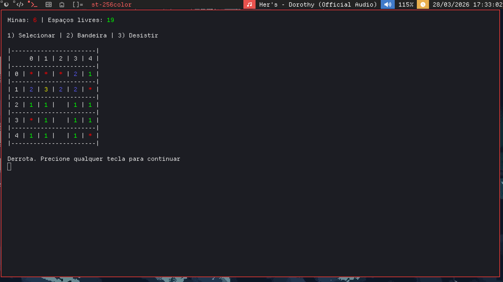

# Minesweeper



Implementação simples do jogo "campo minado" via terminal em C. 
Este projeto foi desenvolvido como um trabalho para a matéria de Programação Imperativa na faculdade.

## Funcionalidades

* Selecionar célula
* Adicionar/remover bandeiras em células
* Placar simples baseado em arquivo
* Coloração via códigos de escape ANSI
* Cross-plataform entre Windows e Linux.

## Ideias de atualizações

* Primeira jogada segura
* Instalação local para o placar
* Melhor distribuição e quantidade de minas
* Melhor segurança (`scanf` sendo utilizado)

## Como buildar

```sh
git clone https://github.com/gustavodileone/minesweeper-term.git
cd minesweeper-term
make
```